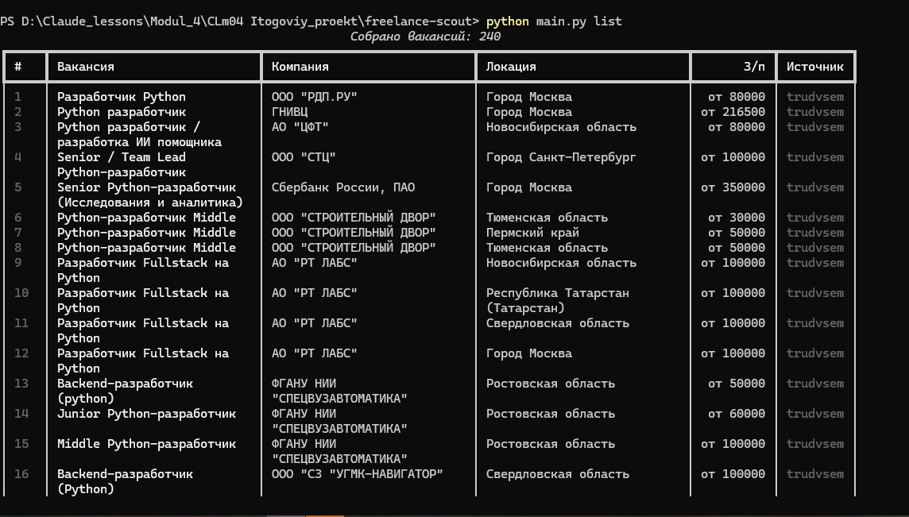
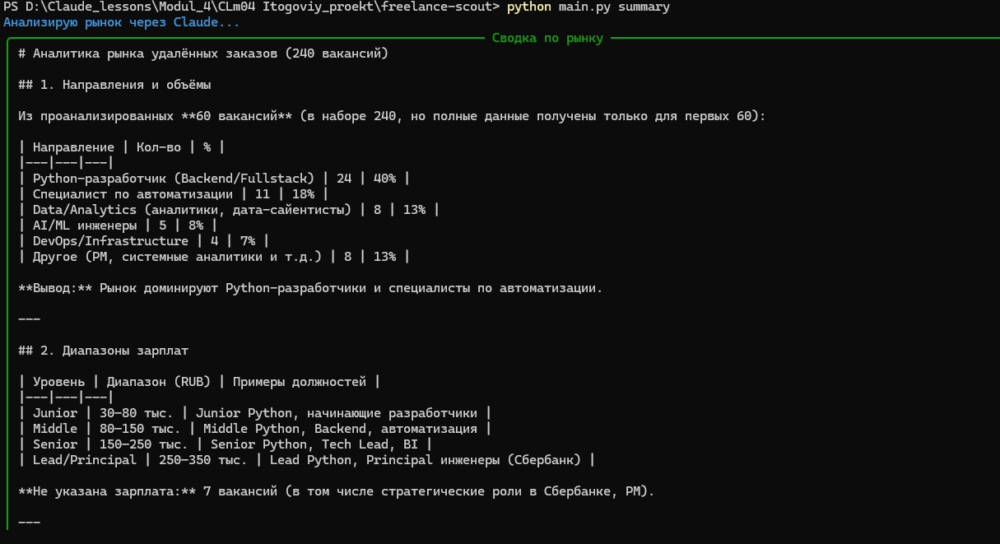
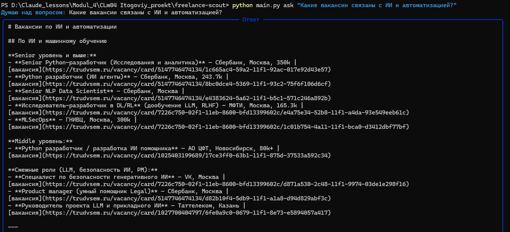

# 🔎 ИИ-разведчик фриланс-заказов

CLI-инструмент, который собирает актуальные вакансии по ИИ-автоматизации,
промпт-инжинирингу и разработке с открытого API российского рынка («Работа России»),
складывает их в таблицу и с помощью Claude даёт сводку по рынку и отвечает на вопросы
по данным. Источники hh.ru и Remotive подключены и дорабатываются на будущих итерациях.

> Финальный проект курса Prompt Engineer. Автоматизирует реальную рутину —
> поиск заказов для фриланса.

---

## ✨ Возможности

- 📥 Сбор вакансий по нескольким запросам с дедупликацией. Рабочий источник —
  `trudvsem` («Работа России», рынок РФ); `hh` и `remotive` в доработке. Ключ не нужен.
- 💾 Сохранение в `CSV` (для Excel) и `JSON` (для программ/LLM)
- 📊 Аккуратная таблица результатов в терминале
- 🤖 Сводка по рынку от Claude: направления, зарплаты, востребованные навыки, топ вакансий
- 💬 Свободные вопросы по собранным данным (ответ строго по реальным вакансиям)

## 🖼 Скриншоты

<!-- Замени плейсхолдеры на свои скриншоты после запуска -->
| Сбор и список | Сводка по рынку |
|---|---|
|  |  |



## 🛠 Стек

Python · requests · anthropic · python-dotenv · rich · API hh.ru / Работа России / Remotive

## 🚀 Установка

```bash
git clone https://github.com/q6066697/freelance-scout.git
cd freelance-scout
python -m venv .venv && source .venv/bin/activate   # Windows: .venv\Scripts\activate
pip install -r requirements.txt
cp .env.example .env        # Windows: copy .env.example .env
```

Открой `.env` и впиши свой `ANTHROPIC_API_KEY` (нужен только для `summary` и `ask`).

## 📖 Использование

```bash
# Собрать вакансии с «Работы России» (рабочий источник, рынок РФ)
python main.py fetch -s trudvsem

# Свои запросы
python main.py fetch -s trudvsem -q "python разработчик" -q "автоматизация"

# Другие источники — в доработке на будущих итерациях:
#   -s hh        рынок РФ, требует доступа к рунету (под зарубежным VPN отдаёт 403)
#   -s remotive  международные удалёнки (англоязычные)

# Показать собранное таблицей
python main.py list

# Сводка по рынку (через Claude)
python main.py summary

# Вопрос по собранным данным (через Claude)
python main.py ask "Какие вакансии связаны с ИИ и автоматизацией?"
```

## 🔐 Безопасность

Секреты лежат в `.env`, который **не коммитится** (см. `.gitignore`).
В репозиторий попадает только `.env.example` с заглушкой. Свой ключ
никому не показывай и не пуши.

## 🌐 Источники данных

Архитектура мультиисточниковая — площадки подключаются через единый интерфейс,
данные приводятся к одной схеме. Статус на текущей итерации:

- ✅ **`trudvsem`** («Работа России») — рабочий источник. На нём собраны данные и
  скриншоты. Открытый API без ключа, доступен в том числе из-под VPN.
- 🛠 **`hh`** (hh.ru) — рынок РФ, в доработке. Требует доступа к рунету; под зарубежным
  VPN API отдаёт `403`. На будущих итерациях — обход через российскую ноду/прокси.
- 🛠 **`remotive`** — международные удалёнки (англоязычные), в доработке под
  отдельный сценарий поиска зарубежных заказов.

Доступ к источнику нужен только команде `fetch` — `summary` и `ask` работают
с уже сохранёнными локально данными.

## 🧩 Скилл

В репозитории есть скилл для Claude Code — `skills/freelance-scout/SKILL.md`.
Он учит агента запускать и расширять разведчик: добавлять источники, менять
запросы, строить отчёты.

## 🗺 Развитие

Допилить источники `hh` (обход геоблока под VPN) и `remotive` (зарубежные заказы) ·
пагинация и история по дням · фильтры до анализа · обёртка в Telegram-бота
с ежедневной рассылкой · векторный поиск (RAG).

---

Сделано на курсе Prompt Engineer · [@AllAllAis](https://t.me/AllAllAis) · [n8nmind.site](https://n8nmind.site)
